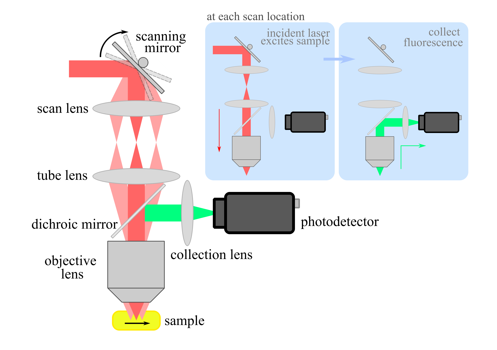
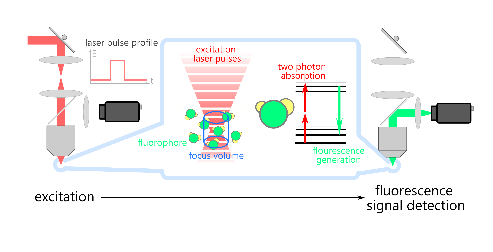

It's really helpful to do some basic math to understand how well an imaging system works when you're designing or improving it. Most of the time, a very basic model of the system can provide a ton of useful information. Therefore, I would like to share an example of how we can crunch some numbers to understand the signal and noise in a two-photon fluorescence microscope (2PFM). In the end, I will also provide a practical demo of how this math can help us make the system work better.

## Introduction to Two-Photon Microscopy

<!-- 
*Light path and principles of two photon fluorescence microscopy (image credit: Jian Zhong)* -->

As shown in the **cover image** of this post, two-photon fluorescence microscopes work by scanning laser beams across a sample and capturing the fluorescent light emitted at each spot. Typically, they use scanning mirrors like galvo mirrors to move the laser beams around. At each scan location, laser beam reflected by the scanning mirrors is relayed to the objective lens using a tube lens and a scan lens. The objective lens then focuses the laser beam into the sample. Afterward, the fluorescence emitted from the sample is gathered by the same objective lens, redirected by a dichroic mirror (which transmits the excitation light while reflects the fluorescence), and finally gathered by some collection optics before being detected by a photodetector (usually a photomultiplier tube (PMT)).

Two photon fluorescence microscopes utilize two-photon excitation phenomenon to make fluorophores in samples light up. This happens when the molecules absorb two photons of light at the same time. Because of its low possibility, two photon excitation only occurs in the focal point inside the sample, where the laser beam is most intense (the density of the excitation photons reaches a maximum). To increase the efficiency of two photon excitation and avoid damaging the sample, two photon microscopes send laser pulses with very short pulse width (~femtosecond) into the sample, instead of using a high power continuous-wave laser . 

## Modeling of the Imaging System

<!-- 
*summary of the imaging system modeling (image credit: Jian Zhong)* -->



At the heart of the two-photon microscope is the two-photon excitation phenomenon. So, when we model these microscopes, we'll follow the sequence of this process: excitation, two-photon absorption, fluorescence generation, and finally fluorescence signal detection. Since each scan location behaves the same way, we'll zoom in on just one spot for our analysis. We'll start by looking at how fluorescence is generated with a single pulse and a single fluorophore, and then we'll generalize our analysis to include multiple laser pulses and all the fluorophores within the focal point.


<p>
To keep our analysis focused on the most crucial factors, I've used "\(\backsimeq\)" notation to show when things are equal by a constant factor, where the constant factor does not depend on the variable explicitly listed on the right-hand-side of the equation. So where wherever we see equation like \( z \backsimeq x \cdot y \), it means \( z = const \cdot (x \cdot y) \), where the constant \(const\) doesn’t depend on \(x\) and \(y\).
</p>


### Excitation Process

Firstly, let’s model the input laser pulses incident to the sample. For most of the two photon systems we can find out the following details about the laser pulses.

- Average power ( \(P_{avg}\) ): We can measure this by putting a power meter after the objective lens.

- Repetition rate ( \(f_{PulseRR}\) ): The laser specs usually tell us this, or we can measure it with an oscilloscope and a fast photo-diode.

- Excitation wavelength ( \(\lambda_{ext}\) ): This is also in the laser specs, or we can measure it with a spectrometer.

- Pulse width ( \(\tau_{PW}\) ): We can measure this with an auto-correlator, or estimate it using the laser specs and the dispersion specs of the optics in the system.

Laser pulses can have different shapes over time, but for our initial estimation, a simple rectangular shape is usually good enough. So, that's what we'll use in our analysis.

With these information, we can first calculate the instantaneous energy within a single laser pulse ( \(E_{Pulse}\) ) as follows:

$$
 E_{Pulse} = \frac{P_{avg}}{f_{PulseRR}}
$$

(*
The trick to understand this formula is not difficult: the total energy during a certain duration  \(\Delta t\) is  \(P_{avg} \cdot \Delta t\), and the number of pulses during this dulation is \(f_{PulseRR} \cdot \Delta t\) so the enery inside each pulse is simply the total energy divided by the number of pulses  \(E_{Pulse} = \frac{P_{avg} \cdot \Delta t}{f_{PulseRR} \cdot \Delta t} = \frac{P_{avg}}{f_{PulseRR}} \)
*)

Considering that we modeled the laser pulse as a rectangular temporal profile, the instantaneous laser power within the duration of the laser pulse ( \(P_{ins}\) ) is as follows:

$$
 P_{ins} = \frac{E_{Pulse}}{\tau_{PW}}
$$

Further analysis of the excitation process requires the knowledge of the excitation focus volume ( \(V_{focus}\) ). We can figure this out by measuring the Point Spread Function (PSF). Or, we can estimate it by modeling the excitation focus volume as a cylinder with a certain base area ( \(A_{focus}\) ) and height ( \(d_{focus}\) ), where the base area and height can be estimated using the lateral and axial resolution of the system respectively.

For conventional two photon microscopes, the lateral resolution ( \(Res_{Lateral}\) ) is given by:

$$
 Res_{Lateral} = 0.51 \frac{\lambda_{ext}}{\sqrt{2} \cdot NA}
$$

while the axial resolution ( \(Res_{Axial}\) ) is given by:

$$
 Res_{Axial} = 0.88 \frac{\lambda_{ext}}{\sqrt{2} (\ n - \sqrt{n^2 - NA^2} \)}
$$

Where the  \(NA\)  is the numberical aperture of focused laser beam,  \(n\)  is the refractive index of the immesion medium. 

Typically, laser beam entering the objective lens fills its backpupil, so the  \(NA\)  of the focused laser beam is the same as the  \(NA\)  of the objective lens. 

For water immersion objetive lenses,  \(n\)  is the refractive index of water ( \(n = 1.33\) ). For dry objective lenses,  \(n\)  is the refractive index of air ( \(n = 1\) ).

With the lateral and axial resolution of the two-photon microscope, the base area ( \(A_{focus}\) ) and height ( \(d_{focus}\) ) of the focus volume can be extimated as:

$$
 d_{focus} \backsimeq Res_{Axial}
$$

$$
 A_{focus} \backsimeq \pi \cdot \( \frac{Res_{Lateral}}{2} \)^2 
$$

With our simplied cylinder model for focus volume, focus volume ( \(V_{focus}\) ) can be calcualted as:

$$
 V_{focus} \backsimeq A_{focus} \cdot d_{focus} \backsimeq \pi \cdot \( \frac{Res_{Lateral}}{2} \)^2 \cdot Res_{Axial}
$$


Then, the instantaneous intensity of the excitation light during the duration of the laser pulse is as follows:

$$
 I_{ins} \backsimeq \frac{P_{ins}}{A_{focus}} = \frac{E_{Pulse}}{A_{focus} \cdot \tau_{PW}} = \frac{P_{avg}}{f_{PulseRR} \cdot A_{focus} \cdot \tau_{PW}}
$$


### Two Photon Absorption and Fluorescence Generation

Next, we'll delve into modeling the two-photon absorption and fluorescence generation within the excitation volume. Typically, this volume contains numerous fluorophores. Initially, we'll concentrate on describing how a single fluorophore  interacts with a single laser pulse, then extend our findings to encompass all the fluorophore within the entire excitation volume interacting with a single laser pulse.

During the two-photon absorption process, a fluorophore in its ground state absorbs two excitation photons and transitions to an excited state with a certain probability. This process is probabilistic, and its efficiency can be quantified using the two-photon transition rate ( \(\omega_{Transition}\) ). This rate essentially tells us how many two-photon absorption events occur per unit time. In quantum mechanics, the two-photon transition rate is defined as follows:

$$
 \omega_{Transition} = \sigma_{2PCross} \cdot \( I_{ins} \)^2 \backsimeq \sigma_{2PCross} \cdot \(\frac{P_{avg}}{f_{PulseRR} \cdot A_{focus} \cdot \tau_{PW}}\)^2
$$

Here,  \(\sigma_{2PCross}\)  is the cross section of two photon absorption, which depends on the properties of the fluorophore. 

Two photon absorption will only happen during the duration of the laser pulse, (during which the fluorophore encounters the excitation photons). With the transition rate, the following formula shows how many times this happens to one molecule during the entire laser pulse. 

$$
 N_{Absorp} = \omega_{Transition} \cdot \tau_{PW}
$$
$$ 
 \backsimeq \sigma_{2PCross} \cdot \(\frac{P_{avg}}{f_{PulseRR} \cdot A_{focus} \cdot \tau_{PW}}\)^2 \cdot \tau_{PW} 
$$
$$
 = \sigma_{2PCross} \cdot P_{avg}^2 \( \frac{1}{f_{PulseRR}} \)^2 \( \frac{1}{A_{focus}} \)^2 \frac{1}{\tau_{PW}}
$$

Once the fluorophore gets excited, it eventually returns to its original state and releases a fluorescence photon. This process happens with a certain probability. We use  \(\eta_{Q}\)  to represent how efficiently this transition occurs from the excited state to emitting a fluorescence photon. It's basically the conversion rate from absorbing two photons to emitting one fluorescence photon. The formula below tells us how many photons a single fluorophore emits during one laser pulse of excitation ( \(N_{FP}\) ).

$$
 N_{FP} = \eta_{Q} \cdot N_{Absorp}
$$

$$
 \backsimeq \eta_{Q} \cdot \sigma_{2PCross} \cdot P_{avg}^2 \( \frac{1}{f_{PulseRR}} \)^2 \( \frac{1}{A_{focus}} \)^2 \frac{1}{\tau_{PW}}
$$

Now, we finished the analysis of a single fluorophore interacting with a single laser pulse. Usually, the excitation volume contains more than one fluorophore. If we denote the density of the fluorophores as  \(\rho_{fluor}\) , then the total number of  fluorophores within the excitation volume ( \(N_{fluor}\) ) can be expressed as:

$$
 N_{fluor} = \rho_{fluor} \cdot V_{focus}
$$

Using the cylindrical model to represent the focused excitation volume, we can express the total number of fluorophores within that volume as follows:

$$
 N_{fluor} = \rho_{fluor} \cdot V_{focus} \backsimeq \rho_{fluor} \cdot A_{focus} \cdot d_{focus}
$$

After a single laser pulse hits the sample, the total number of fluorescence photons emitted from the focus volume ( \(N_{totFP}\) ) is just the result of multiplying the total number of fluorophores (within the focus volume) by the number of fluorescence photons emitted by each fluorophore.  

$$
 N_{totFP} = N_{fluor} \cdot N_{FP} 
$$
$$
 \backsimeq \( \rho_{fluor} \cdot A_{focus} \cdot d_{focus} \) \cdot \( \eta_{Q} \cdot \sigma_{2PCross} \cdot P_{avg}^2 \( \frac{1}{f_{PulseRR}} \)^2 \( \frac{1}{A_{focus}} \)^2 \frac{1}{\tau_{PW}} \)
$$
$$
 =  \rho_{fluor} \cdot  \eta_{Q} \cdot \sigma_{2PCross}  \cdot P_{avg}^2 \( \frac{1}{f_{PulseRR}} \)^2 \( \frac{1}{\tau_{PW}} \) \( \frac{1}{A_{focus}} \) \cdot d_{focus}
$$

### Fluorescence Signal Detection  

The fluorescence photons will be collected by the objective lens, travel through the detection light path, and be detected by the photon detector. The photon detector converts them into a specific type of signal, usually electrical, which is easy to record and save. While the process of collecting them can be complex, we can simplify it by describing the efficiency of converting fluorescence photons to signals using a factor ( \(\eta_{collect}\) ). This factor encompasses various elements like the numerical aperture of the objective lens, the transmission of the detection optics, and the conversion efficiency of the detectors. The signal is usually measured by the number of photons recorded, which we'll call "signal photons" here. So, the total count of signal photons ( \(N_{Signal}\) ) generated by one laser pulse can be expressed as:

$$
 N_{Signal} = \eta_{collect} \cdot N_{totFP} 
$$

$$
 \backsimeq \eta_{collect} \cdot \rho_{fluor} \cdot  \eta_{Q} \cdot \sigma_{2PCross}  \cdot P_{avg}^2 \( \frac{1}{f_{PulseRR}} \)^2 \( \frac{1}{\tau_{PW}} \) \( \frac{1}{A_{focus}} \) \cdot d_{focus}
$$

### Integration of Multiple Pulses and Signal-to-Noise Ratio

Typically, in two-photon microscopes, the microscope stays at each pixel spot (or, scan location) for a specific amount of time (which is usually called dwell time). During this time, multiple laser pulses hit the sample, and all the fluorescence generated by these pulses are collected. So, the overall signal for each pixel spot (or, scan location) can be calculated like this:

$$
 N_{totSignal} = N_{pulse} \cdot N_{Signal} 
$$
$$
 \backsimeq N_{pulse} \cdot \eta_{collect} \cdot \rho_{fluor} \cdot  \eta_{Q} \cdot \sigma_{2PCross}  \cdot P_{avg}^2 \( \frac{1}{f_{PulseRR}} \)^2 \( \frac{1}{\tau_{PW}} \) \( \frac{1}{A_{focus}} \) \cdot d_{focus}
$$ 

Where  \(N_{Pulse}\)  is the number of laser pulses that hit the sample at each scan location.

The distribution of signal photons usually follows a Poisson distribution. If we suppose that all other sources of noise in the system, like electrical noise, ambient light leaking in, or fluctuations in the laser pulse energy, are negligible, the signal to noise ratio (SNR) of each scan location can be written as:

$$
 SNR = \sqrt{N_{totSignal}}
$$

### Side Notes

Usually, the specific characteristics of the fluorophores ( \(\rho_{fluor}\) ,  \(\eta_{Q}\) , and  \(\sigma_{2PCross}\) ) are difficult to be quantified. However, we can compare the signals from two fluorophores under the same conditions. By doing this, we can determine how much brighter one fluorophore is compared to another. Taking in the formula we derived above, for fluorophores A and B, if we image them with the same two photon microscope and exactly the same condition, we can have the following comparison result: 

$$
 \frac{ \rho_{fluor_A} \cdot \eta_{Q_A} \cdot \sigma_{2PCross_A}  }{ \rho_{fluor_B} \cdot \eta_{Q_B} \cdot \sigma_{2PCross_B} } = \frac{N_{totSignal_A}}{N_{totSignal_B}}
$$

## Example Application

As a practice, let’s explore how to double the signal-to-noise ratio (SNR) of a two photon microscope.

To improve the signal-to-noise ratio (SNR) of a two-photon imaging system by two times, we need to boost the signal by four times, according to the formula mentioned earlier. Here are some potential strategies we can consider:

- Increase dwell time at each pixel by four times. This means letting the microscope linger longer at each pixel to gather more signal from the incident pulses. However, this might slow down the overall imaging process or reduce the number of pixels in the image, which could affect certain applications.

- Compress the pulse duration by four times. Adding a module for pulse compression or dispersion compensation optics in the system can achieve this. It helps in packing more energy into each pulse, potentially enhancing the signal.

- Double the average power. While increasing power can boost signal strength, it must be done cautiously to avoid damaging the sample.
- Enhance detection efficiency by four times. This involves optimizing both the optical and electronic designs of the detection system to capture more of the fluorescence signal.

These methods aren't mutually exclusive; we can combine several approaches to achieve the desired increase in SNR. However, it's crucial to carefully evaluate the impact of each strategy on the overall system performance and the specific requirements of the application at hand.


## Conclusion

Understanding the imaging system in numbers is key for its design and optimization. The simplest math models and assumptions are a good start for our analysis, and usually reveal a lot about the system. Also, keep in mind the assumptions and simplifications we made during modeling. This way, we can easily come back to validate and refine your model later if needed.

## Citation

If you found this article helpful, please cite it as:
> Zhong, Jian (Apr 2024). Basic Math for Two Photon Fluorescence Microscopy. Vision Tech Insights. https://jianzhongdev.github.io/VisionTechInsights/posts/basic_math_for_two_photon_fluorescence_microscopy/.

Or

```html
@article{zhong2024basicmath2PFM,
  title   = "Basic Math for Two Photon Fluorescence Microscopy",
  author  = "Zhong, Jian",
  journal = "jianzhongdev.github.io",
  year    = "2024",
  month   = "Apr",
  url     = "https://jianzhongdev.github.io/VisionTechInsights/posts/basic_math_for_two_photon_fluorescence_microscopy/"
}
```


